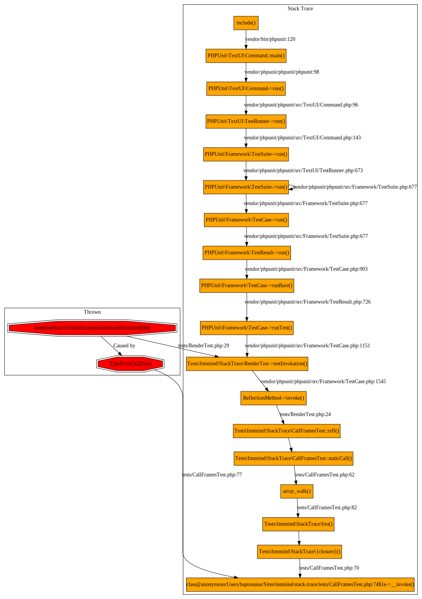

# StackTrace

[](https://github.com/innmind/stacktrace/actions?query=workflow%3ACI)
[](https://codecov.io/gh/innmind/stacktrace)
[](https://shepherd.dev/github/innmind/stacktrace)

Tool to inspect an Exception stack trace

## Installation

```sh
composer require innmind/stack-trace
```

## Usage

```php
use Innmind\StackTrace\{
    StackTrace,
    Render,
};
use Innmind\OperatingSystem\Factory;
use Innmind\Server\Control\Server\Command;

$trace = StackTrace::of(new AnyClassImplementingPhpThrowableInterface);

// every call frames that lead to the exception to be thrown
// (deepest call frame first)
$callFrames = $trace->throwable()->callFrames();

// this will render the stack trace via graphviz
Factory::build()
    ->control()
    ->processes()
    ->execute(
        Command::foreground('dot')
            ->withShortOption('Tsvg')
            ->withShortOption('o', 'graph.svg')
            ->withInput(
                Render::of()($trace)
            ),
    )
    ->wait();
```

**Note**: the svg rendered contains links to the files where call frames and exceptions occured, you can change the link by providing an instance of [`Link`](src/Link.php) to the `Render` object.

Example of a rendered stack trace: 
